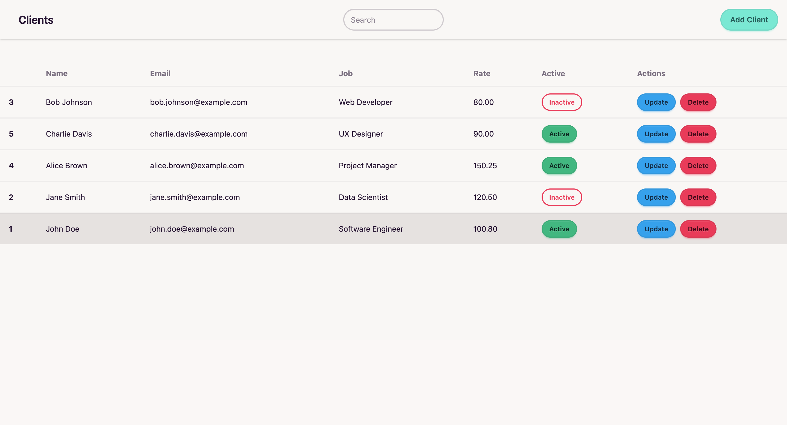

# web-crud-application

This project is created for practicing web development.

## About the Project

This is a web-based CRUD (Create, Read, Update, Delete) application. It consists of a backend built with Node.js and a frontend built with React.

## How to Set Up and Run the Project

### Prerequisites

- Ensure you have Node.js and npm installed on your system.
- Install Git to clone the repository.

### Steps to Set Up

1. Clone the repository:
   ```bash
   git clone https://github.com/aminuaminaldo/web-crud-application.git
   ```
2. Navigate to the project directory:
   ```bash
   cd web-crud-application
   ```

### Backend Setup

1. Navigate to the backend folder:
   ```bash
   cd backend
   ```
2. Install dependencies:
   ```bash
   npm install
   ```
3. Start the backend server:
   ```bash
   npm start
   ```

### Frontend Setup

1. Navigate to the frontend folder:
   ```bash
   cd ../frontend
   ```
2. Install dependencies:
   ```bash
   npm install
   ```
3. Start the frontend development server:
   ```bash
   npm run dev
   ```

### Access the Application

- Open your browser and navigate to the URL provided by the frontend development server (usually `http://localhost:5173`).

## Screenshots

### Frontend Screenshot

Upload a screenshot of the frontend here.

